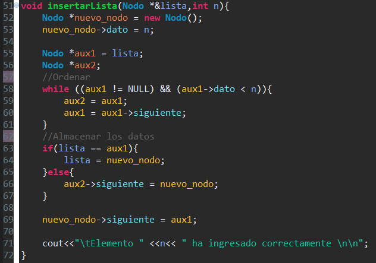
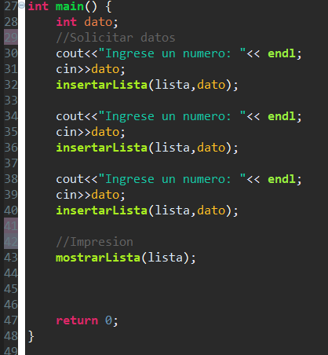

# Tarea Laboratorio 5 Programación Avanzada

### Carlos Andrés Cuéllar Velásquez 2497117
       
## a) Bitácora

1. Inicializar el programa.

   1.1 Se incluyen todas las librerias a utilizar. 
   
   1.2 Se hace la funcion del Nodo.
   
   1.3 Se hacen los prototipos de cada uno de los metodos a utilizar para poder escribirlos abajo del main.
   
   1.4 Se declaran la variable global. 

 

 
2. Insertar Valor.

   2.1 Se declara el objeto nuevo nodo y dos variables auxiliares nodo. 
   
   2.2 Mediante un ciclo while se pone el valor con menos valor en la cabeza de la lista y que elemento va abajo dependiendo de su valor.
   
   2.3 Mediante una sentencia If/Else se colocan el resto de los elementos en orden. 
   

3. Mostrar los elementos de la lista.

   3.1 Se inicializa el objeto Nodo "Actual" y se iguala a lista
   
   3.2 Mediante un ciclo while el nodo Actual recorrera la lista hasta que si valor sea NULL que nos dara la pauta que la lista acabo.

4. Main.

      4.1 Se crea el main, dentro se solicita al usuario ingresar 3 datos y se llama a la funcion insertarLista donde los ordenara y          almacenara. 
   
      4.2  Se llama a la funcion mostrarLista donde se imprimira la lista en forma ascendente.
   

